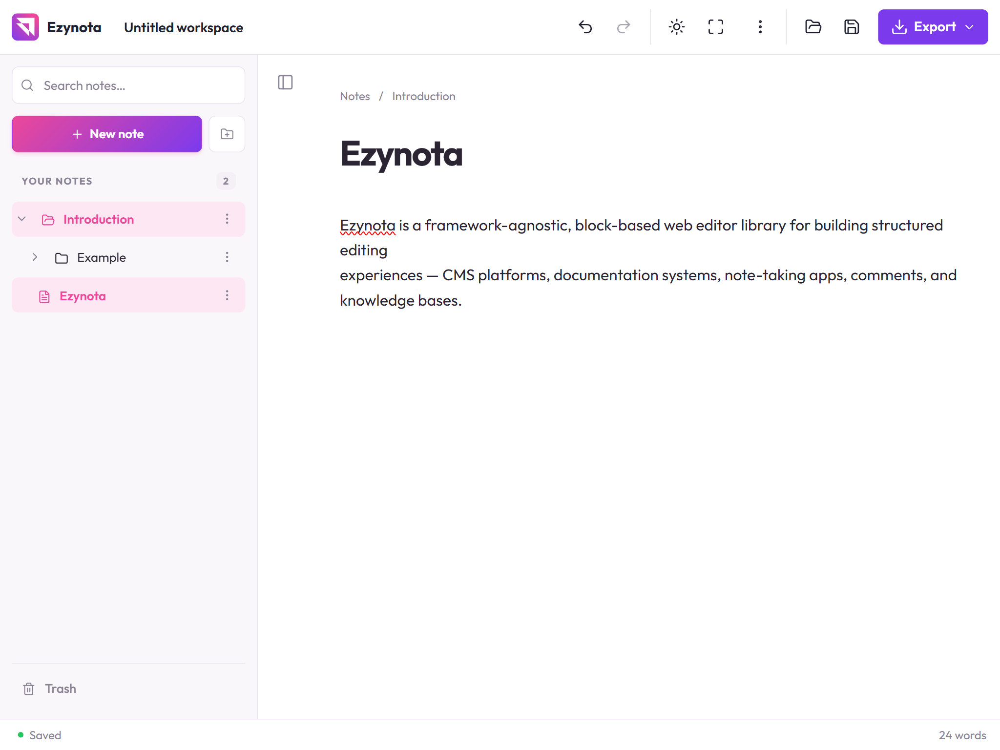

# Ezynota

[](https://opensource.org/licenses/MIT)
[](https://github.com/bookklik-technologies/ezynota)

**A free, block-style editor with portable JSON output.** Ezynota is a
framework-agnostic, block-based web editor library for building structured
editing experiences — CMS platforms, documentation systems, note-taking apps,
comments, and knowledge bases.



## Features

- **Block-first** — every paragraph, heading, list, quote, code block or divider is a block
- **JSON-first** — inline rich text is stored as portable JSON, never as opaque HTML strings
- **Transaction-driven** — every edit becomes a typed transaction against the document model; the DOM is only a view
- **Browser-local workspaces** — folders, linked notes, trash, search and IndexedDB storage
- **Interchange** — lossless JSON, Markdown and sanitized HTML import/export, find/replace, themes, RTL, fullscreen
- **Accessible and secure by default** — keyboard-complete operation, ARIA menus, sanitized pasted HTML, no `eval`
- **Zero runtime dependencies**

## Documentation

Full guides and API reference: <https://bookklik-technologies.github.io/ezynota/>

- [Development skills](docs/guide/development-skills.md) — seven repository skills for AI-assisted document, tool, tune, workspace, interchange and UI development

## Quick start

### Declarative (browser bundle)

```html
<link rel="stylesheet" href="ezynota.css" />
<div data-ezn-editor></div>
<script src="ezynota.umd.cjs"></script>
```

Every `[data-ezn-editor]` element mounts a **workspace editor** after DOM
readiness; elements inserted later are observed automatically. Mounts emit
bubbling `ezn:ready`, `ezn:change` and `ezn:error` DOM events. Attributes
(`data-ezn-mode`, `data-ezn-theme`, `data-ezn-readonly`, `data-ezn-workspace`,
…) configure the mount — see the [declarative guide](docs/guide/declarative.md).

### ESM / bundlers

```bash
npm install ezynota
```

```ts
import { Ezynota } from "ezynota";           // main entry (declarative scanning side effect)
import { Ezynota } from "ezynota/core";     // no automatic scanning
import "ezynota/dist/ezynota.css";

const editor = new Ezynota({
  target: "#editor",
  placeholder: "Start writing...",
  onReady(api) {},
  onChange(api, batch) {}
});
```

## Examples

Self-contained demos in the [examples folder](examples/README.md) — served via
any static server (e.g. WAMP: `http://localhost/ezynota/examples/`).

## Development

```bash
pnpm install
pnpm test        # Vitest unit suite
pnpm typecheck   # TypeScript strict
pnpm lint        # ESLint
pnpm build       # ESM + UMD (.cjs) + TypeScript declarations + CSS into dist/
```

## Status

v0.1.1 — release-candidate quality: browser-local multi-note workspaces, four
lifecycle modes, tables, images, callouts, collapsible sections and Markdown
interchange. Accounts, server synchronization, collaboration and direct
DOCX/PDF conversion are not currently included; real-browser checks (mobile,
IME, screen readers) remain outstanding.

## License

MIT
